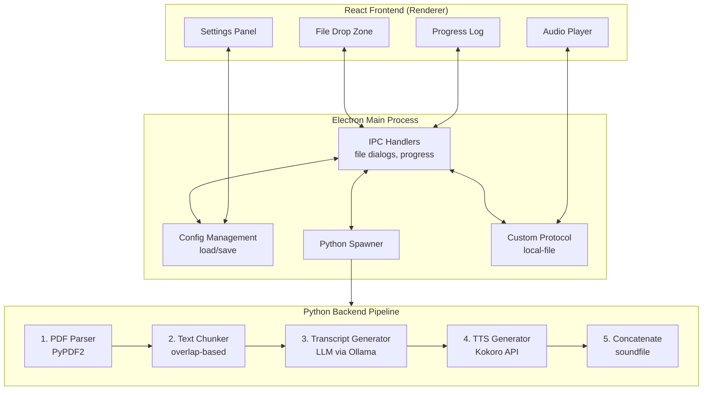

# Local NotebookLM Desktop App

A beautiful desktop application for [Local-NotebookLM](https://github.com/Goekdeniz-Guelmez/Local-NotebookLM) that provides an intuitive UI for converting PDFs to engaging audio content.

## Features

- **Drag & Drop PDF Upload** - Simple file selection with visual feedback
- **Comprehensive Settings** - Customize format, style, length, speakers, and more
- **Real-time Progress** - Watch the generation process with live logs
- **Built-in Audio Player** - Play generated audio directly in the app
- **Export Options** - Export to WAV or MP3 formats
- **Desktop Packaging** - Build native installers for macOS, Windows, and Linux
- **VLM Mode** - Include PDF images in generation for multimodal understanding
- **Character Generation** - Automatically creates distinct speaker personalities for long-form content

## Architecture & Pipeline

The application follows a multi-process architecture combining a React frontend, Electron main process, and Python backend:



### Pipeline Stages

#### 1. PDF Text Extraction (`processor.py:extract_text_from_pdf`)
- Uses **PyPDF2** to extract text from PDF documents
- Supports up to 1.2M characters based on length setting
- Handles multi-page documents with automatic pagination

#### 2. Image Extraction (Optional VLM Mode)
- When VLM mode is enabled, extracts embedded images from PDF
- Supports PNG, JPEG, GIF, and WebP formats
- Limits images based on length: short (2), medium (4), long (8)
- Converts images to base64 data URLs for multimodal LLM processing

#### 3. Smart Text Chunking (`processor.py:chunk_text`)
Splits text based on desired output length:

| Length | Chunk Size | Overlap | Max Chunks |
|--------|-----------|---------|------------|
| Short  | 30,000    | 300     | 2          |
| Medium | 15,000    | 300     | 4          |
| Long   | 5,000     | 200     | Unlimited  |

- Overlapping chunks maintain context continuity
- Smaller chunks for longer outputs = more detailed content

#### 4. Character Generation (Long-form only)
For "long" length setting, generates distinct speaker personalities:
- Each speaker gets: persona, expertise, and speaking style
- Creates more engaging, natural-sounding conversations
- Characters passed to LLM for consistent voice across chunks

#### 5. Transcript Generation (`processor.py:generate_transcript`)
**LLM Integration:**
- Connects to Ollama API at `http://localhost:11434/v1`
- Uses OpenAI-compatible API format
- Supports various models (default: gemini-3-flash-preview:cloud)

**Prompt Engineering:**
- System prompt includes format, style, and length guidance
- Format options: podcast, interview, panel-discussion, summary, lecture, tutorial, debate, meeting, analysis
- Style options: normal, formal, casual, enthusiastic, serious, humorous, gen-z, technical
- Chunk-aware: first/last/middle chunks get different instructions
- Context passing: Previous 3 speaker turns included for continuity

**Output Format:**
```json
{
  "transcript": [
    {"speaker": "Speaker 1", "text": "Welcome to the show!"},
    {"speaker": "Speaker 2", "text": "Glad to be here."}
  ]
}
```

#### 6. TTS Audio Generation (`processor.py:generate_tts_audio`)
- Connects to Kokoro TTS API at `http://localhost:8880/v1`
- Generates audio segment by segment
- Speaker-to-voice mapping:

| Speaker | Voice Configuration |
|---------|---------------------|
| Speaker 1 | af_bella(1.4)+af_sky(0.8) |
| Speaker 2 | am_michael+am_fenrir |
| Speaker 3 | am_echo |
| Speaker 4 | af_aoede(1)+af_kore(1)+af_sky(1.6) |
| Speaker 5 | am_adam |
| Speaker 6 | af_nova+af_jadzia |
| Default | af_nova |

#### 7. Audio Concatenation
- Uses `soundfile` and `numpy` to concatenate segments
- Ensures consistent sample rates across segments
- Outputs final WAV or MP3 file

## Prerequisites

- Node.js 18+ and npm
- Python 3.x with `local-notebooklm` package installed
- **Ollama** running locally on port 11434 (for LLM inference)
- **Kokoro** TTS service running on port 8880 (for text-to-speech)

### Installing External Services

#### Ollama (LLM Backend)
```bash
# macOS
brew install ollama

# Linux
curl -fsSL https://ollama.com/install.sh | sh

# Start Ollama
ollama serve

# Pull a model (e.g., gemma3)
ollama pull gemma3
```

#### Kokoro (TTS Backend)
Follow the [Kokoro FastAPI](https://github.com/Goekdeniz-Guelmez/kokoro) setup instructions to run the TTS service locally.

## Installation

```bash
# Install Node dependencies
npm install

# Run in development mode
npm run dev
```

In development, start the Vite dev server, then in another terminal:
```bash
npx electron .
```

## Building Installers

The build process bundles Python packages for distribution:

```bash
# Bundle Python dependencies first
npm run bundle-python

# macOS DMG
npm run electron:build:dmg

# Windows NSIS installer
npm run electron:build:win

# Linux AppImage and deb package
npm run electron:build:linux

# All platforms (CI/CD)
npm run electron:build:all
```

Artifacts are created in the `release` folder.

**Important:** Because the app bundles native Python packages (`numpy`, `soundfile`, etc.), you must build on the target platform. Cross-compilation is not supported.

## Project Structure

```
├── electron/                # Electron main and preload scripts
│   ├── main.ts              # Main process (IPC, window management)
│   └── preload.ts           # Preload script for secure IPC
├── src/                     # React frontend
│   ├── App.tsx              # Main app component
│   ├── main.tsx             # React entry point
│   └── index.css            # Tailwind styles
├── local_notebooklm/        # Python processing module
│   ├── __init__.py
│   ├── processor.py         # Core pipeline logic
│   └── make_audio.py        # CLI entry point
├── scripts/                 # Build helpers
│   └── bundle-python.mjs    # Python packaging script
├── build/                   # App assets (icons, etc.)
├── release/                 # Built application output
├── python-packages/         # Bundled Python dependencies
└── dist/                    # Compiled frontend
```

## Configuration

The app stores user configuration in the system app data directory:

- **macOS:** `~/Library/Application Support/local-notebooklm-app/`
- **Windows:** `%APPDATA%/local-notebooklm-app/`
- **Linux:** `~/.config/local-notebooklm-app/`

### Configurable Options

| Setting | Default | Description |
|---------|---------|-------------|
| llmApiUrl | http://localhost:11434/v1 | Ollama API endpoint |
| llmApiKey | (empty) | API key if using external service |
| ttsApiUrl | http://localhost:8880/v1 | Kokoro TTS endpoint |
| ttsApiKey | (empty) | TTS API key |
| ttsModel | kokoro | TTS model name |
| ttsVoiceModel | alloy | Default voice model |
| speakerVoices | (various) | Per-speaker voice mappings |
| defaultOutputDir | (appData)/outputs | Default save location |

## Generation Settings

### Format Types
- **Podcast** - Conversational multi-speaker format
- **Interview** - Question-and-answer style
- **Panel Discussion** - Multiple speakers with balanced discussion
- **Summary** - Brief overview of main points
- **Narration** - Single speaker narration
- **Article** - Formal structured content
- **Lecture** - Educational detailed explanation
- **Q&A** - Question and answer format
- **Tutorial** - Step-by-step instructional
- **Debate** - Contrasting viewpoints
- **Meeting** - Professional discussion
- **Analysis** - In-depth examination

### Styles
- **Normal** - Balanced conversational
- **Formal** - Professional polished tone
- **Casual** - Informal and relaxed
- **Enthusiastic** - Energetic and engaging
- **Serious** - Solemn and focused
- **Humorous** - Light humor and wit
- **Gen-Z** - Internet slang, memes, TikTok references
- **Technical** - Domain-specific expert language

### Length Options
- **Short** - 2-5 minutes, concise overview
- **Medium** - 5-10 minutes, balanced detail
- **Long** - Extended depth with character generation

### Speakers
- Configurable 1-6 speakers depending on format
- Automatic format-appropriate minimums
- Character profiles for long-form content

## Development

### Running Locally

```bash
# Terminal 1: Start Vite dev server
npm run dev

# Terminal 2: Start Electron
npx electron .
```

### Environment Variables (Runtime)

When the Python process spawns, these environment variables are set:

```bash
LLM_API_URL=http://localhost:11434/v1
LLM_API_KEY=not-needed
TTS_API_URL=http://localhost:8880/v1
TTS_API_KEY=not-needed
TTS_MODEL=kokoro
TTS_VOICE_MODEL=alloy
SPEAKER_VOICES={"Speaker 1": "af_bella(1.4)+af_sky(0.8)", ...}
PYTHONPATH=/path/to/bundled/packages
```

## CLI Usage

The Python module can also be used standalone:

```bash
python -m local_notebooklm.make_audio \
  --pdf document.pdf \
  --output_dir ./output \
  --llm_model gemma3 \
  --language english \
  --format_type podcast \
  --style casual \
  --length medium \
  --num_speakers 2 \
  --is-vlm
```

## License

MIT
